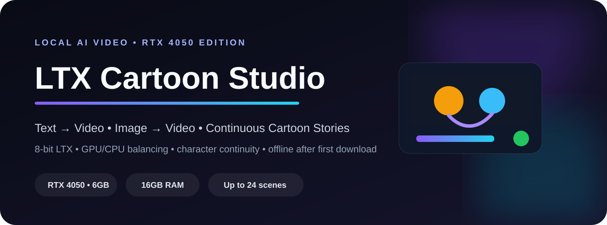
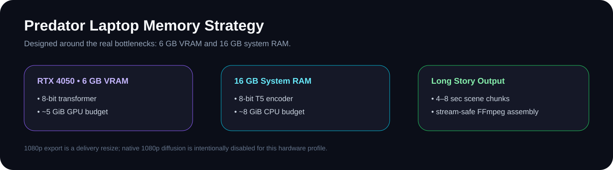
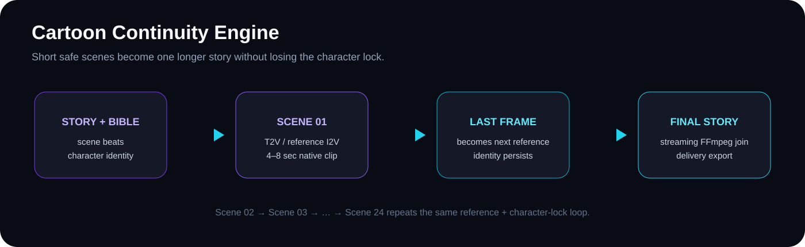

<p align="center">
  
</p>

<p align="center">
  
  
  
  
  
</p>

# LTX Cartoon Studio

A premium local AI video workspace built around **Lightricks LTX-Video** and tuned for a laptop-class **RTX 4050 (6 GB VRAM) + 16 GB RAM** setup. It supports text-to-video, reference image animation, short native clips, long multi-scene cartoon stories, character continuity, and delivery-ready landscape/portrait/square exports.

> **No cloud video API is required after the first model download.** Hugging Face is used to fetch and cache the official open model files on first setup.

## Why this build is different

The previous version of this repository pointed at **LTX-2.3 22B** and claimed 6 GB VRAM support. That was not a safe hardware match. This revision switches the default architecture to the official **2B LTX-Video Diffusers path**, loads the transformer and T5 encoder in **8-bit**, balances memory between GPU and CPU, enables VAE tiling/slicing, and avoids holding a complete long cartoon in RAM.

<p align="center">
  
</p>

## How many seconds can it generate?

LTX-Video 0.9.8 introduced long-shot support up to **60 seconds** in the heavier 13B workflow. That is not the target mode for this laptop.

For this RTX 4050 / 16 GB RAM profile, the UI intentionally exposes native clips from **49 to 241 frames**. At 30 FPS that is roughly **1.6 to 8.0 seconds per generated scene**. The default is **121 frames ≈ 4.0 seconds**.

Why cap at 241 frames? Lightricks recommends frame counts in the `8k+1` pattern and says LTX works best below 257 frames. Short scene generation is also dramatically safer for 6 GB VRAM.

For long cartoons, use **Cartoon Story Studio**. It supports up to **24 scenes per batch**, so the UI can assemble roughly **3+ minutes** when the longest scene duration is selected, while generating only one short scene at a time.

<p align="center">
  
</p>

## Cartoon Story Studio

The story workflow is built to reduce the most common AI-cartoon failure: characters changing from scene to scene.

1. Write the full story or add **one scene beat per line**.
2. Define a **Character Bible**: face, colors, clothing, props, proportions and identifying details.
3. Optionally upload a character/style reference image for Scene 1.
4. Choose a cartoon style, scene count, native resolution and duration per scene.
5. Scene 1 is generated from text or your reference image.
6. The final frame is extracted and becomes the reference image for Scene 2.
7. The same character bible and visual style are injected into every scene prompt.
8. The process repeats through the story.
9. FFmpeg joins the clips using a streaming workflow so a long video does not fill 16 GB RAM with decoded frames.
10. Export the final movie as native MP4 or a delivery-size 720p/1080p landscape, portrait or square video.

### Included cartoon looks

- Premium 3D Kids Animation
- Claymation
- 2D Storybook
- Anime Adventure
- Soft hand-painted fantasy animation
- Comic Toon

## One-command start

### Windows

```powershell
python -m venv venv
venv\Scripts\activate
python run.py
```

### Linux

```bash
python -m venv venv
source venv/bin/activate
python run.py
```

`run.py` checks the Python runtime packages, installs missing dependencies, downloads the model cache if it is not already present, and launches the local UI at:

```text
http://127.0.0.1:7860
```

The first setup needs internet access for Hugging Face downloads. Later launches reuse the local cache.

## Recommended Predator / RTX 4050 settings

| Goal | Resolution | Frames | Approx duration | Notes |
|---|---:|---:|---:|---|
| First test | 384×224 | 49 | 1.6 s | Safest smoke test |
| Normal cartoon scene | 384×224 | 121 | 4.0 s | **Recommended default** |
| Better framing | 512×288 | 121 | 4.0 s | More VRAM pressure |
| Longer scene | 384×224 | 193 | 6.4 s | Heavy |
| Practical native maximum | 384×224 | 241 | 8.0 s | Highest UI option |

Start with the recommended default. Only raise resolution or duration after one successful generation.

## Text-to-Video and Image-to-Video

The **Create Video** page uses the same interface for both modes:

- Leave the reference image empty → Text-to-Video
- Upload an image → Image-to-Video

Write prompts with **subject + action + environment + camera + lighting + visual style**. For cartoons, keep descriptions stable between related clips.

## Download sizes

Native generation stays intentionally small for the 4050. The export layer can produce:

- Native MP4
- 1280×720
- 1920×1080
- 720×1280
- 1080×1920
- 1080×1080

The 720p/1080p options are high-quality delivery resizes using FFmpeg. They do **not** create new AI detail. Native 1080p diffusion is disabled in this profile because it is not a safe target for 6 GB VRAM.

## Memory architecture

```text
Prompt / Reference
       │
       ▼
8-bit T5 Text Encoder ───────┐
                             │ GPU/CPU balanced placement
8-bit LTX 2B Transformer ────┤  RTX 4050 budget ≈ 5 GiB
                             │  CPU budget ≈ 8 GiB
Tiled/Sliced Video VAE ──────┘
       │
       ▼
Short Native MP4
       │
       ├── single clip → delivery export
       │
       └── story mode → last frame → next scene → FFmpeg streaming join
```

## Repository layout

```text
Ltxvideo/
├── app.py                       # Premium Gradio UI
├── run.py                       # One-command bootstrap + launch
├── config.py                    # RTX 4050 presets and safety caps
├── download_models.py           # Hugging Face offline cache preparation
├── requirements.txt
├── engine/
│   ├── generator.py             # Quantized T2V / I2V backend
│   ├── storyboard.py            # Cartoon character + scene continuity
│   ├── memory_manager.py        # Hardware detection
│   └── video_processor.py       # Streaming join + delivery exports
├── static/
│   └── style.css                # Premium dark UI
├── docs/assets/                 # README artwork
├── tests/
└── outputs/
```

## Testing

Run the lightweight repository tests without loading the video model:

```bash
python -m unittest discover -s tests -v
```

Syntax check:

```bash
python -m py_compile app.py config.py run.py download_models.py engine/*.py
```

A full generation test requires the NVIDIA GPU, CUDA runtime, downloaded Hugging Face weights and enough free disk/RAM. The UI deliberately starts with conservative presets for that reason.

## Troubleshooting

**CUDA out of memory**  
Close GPU-heavy applications, use `384×224`, choose 49/97/121 frames, and restart the app to clear VRAM.

**Windows becomes slow while loading**  
Close browsers/games and ensure the Windows page file is enabled. The text encoder and transformer are quantized, but 16 GB RAM is still a tight environment for modern video diffusion.

**First run takes a long time**  
The model files are being downloaded and cached. Later runs reuse them.

**1080p looks similar to native**  
That preset is a delivery resize, not an AI super-resolution pass.

## Model and upstream projects

- [Lightricks/LTX-Video](https://github.com/Lightricks/LTX-Video)
- [Lightricks LTX-Video on Hugging Face](https://huggingface.co/Lightricks/LTX-Video)
- [Hugging Face Diffusers LTX documentation](https://huggingface.co/docs/diffusers/api/pipelines/ltx_video)

## License

This repository contains application code around upstream model/runtime projects. Review the LTX-Video model license and all third-party licenses before commercial distribution.
